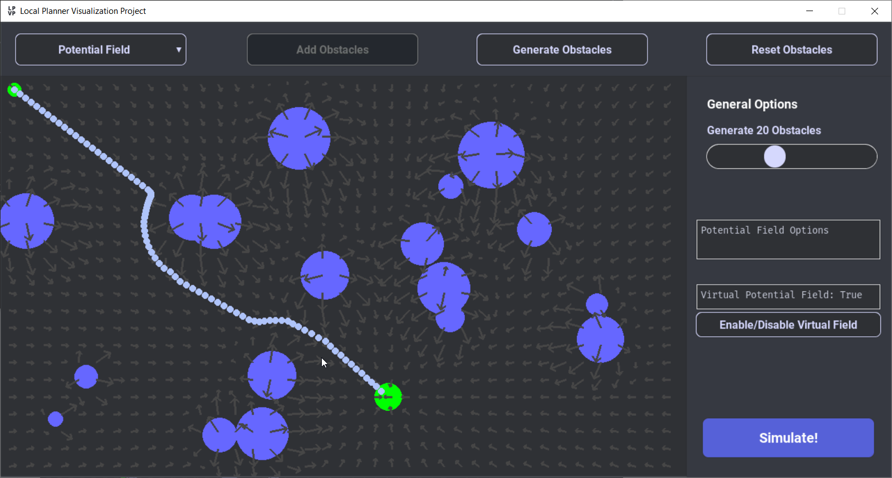

# CSC477 Tutorial #2 - Artificial Potential Field
The potential field planner is adapted from the concept of a charged particle travelling through a charged field. The goal postion emits a attractive force, and the obstacles emit a repulsive force. We can emulate this behaviour by creating a artificial potential field that attracts the robot towards the goal. The goal postion emits a strong attractive field, and each obstacle emits a repulsive field. By following the sum of all fields at each position, we can construct a path towards the goal postion.

## Setup the environment
```
pip install -r requirement.txt
```

## To Do
Please navigate to `planner.py` and search for `TODO`.

Once you finish your implementation, please run 
```
python3 main.py
```

<!-- --- -->
Please refer to `planner_sol.py` for solution.

## Demo



