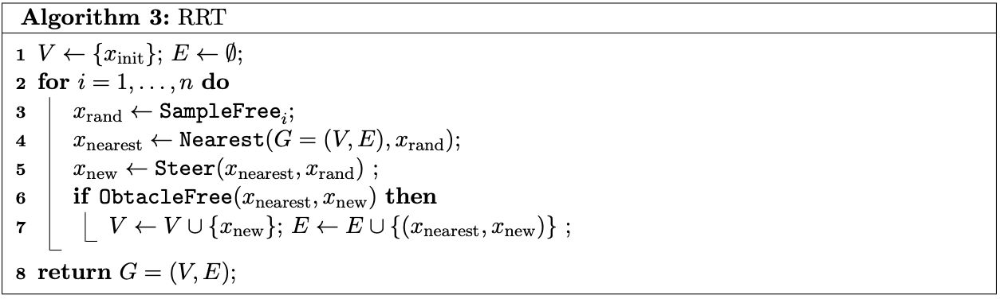

# CSC477 Tutorial #4 - Informed RRT*

<table>
  <tr>
    <td> </td>
    <td></td>
    <td></td>
   </tr> 
</table>

In this tutorial, we are going to explore a variant of RRT, informed RRT*.

## Recap

## RRT*

- `Near`: acquiring a set of nodes that closed to the current tree/graph
- `CollisionFree`: checking whether the segment of two nodes exists in the current tree

## Informed RRT*

The solution cost versus computational time for RRT* and Informed RRT* on a random world problem. Both planners were run until they found a solution of the same cost. Figs. (a, c) show the final result, while Fig. (b) shows the solution cost versus computational time. From Fig. (a), it can be observed that RRT* spends significant computational resources exploring regions of the planning problem that cannot possibly improve the current solution, while Fig. (c) demonstrates how Informed RRT* focuses the search. 

## To Do
Please try to complete `informed_rrt_star.py`.

## Reference
- Sampling-based Algorithms for Optimal Motion Planning
- Informed RRT*: Optimal Sampling-based Path Planning Focused via Direct Sampling of an Admissible Ellipsoidal Heuristic
